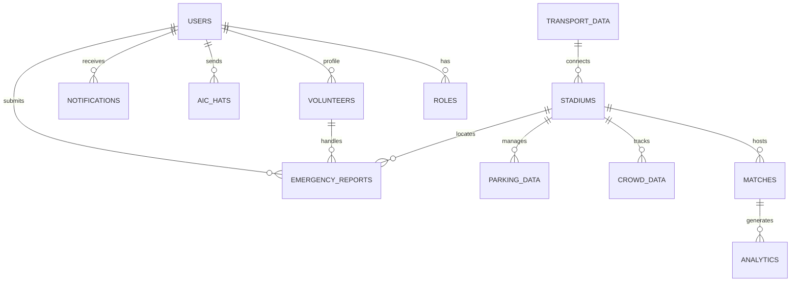

# Database Schema: FIFA AI Smart Stadium Copilot

This document outlines the complete relational database schema designed for the **FIFA AI Smart Stadium Copilot** platform. The database uses **MySQL** as its storage engine and is optimized for high-read dashboard analytics, quick indexing of crowd sensors, and low-latency AI chat history queries.

---

## Entity Relationship Diagram (ERD) Overview



---

## 1. DDL Schema Definition

Below is the complete, execution-ready MySQL DDL script with all primary keys, foreign keys, constraints, and operational indexes.

```sql
CREATE DATABASE IF NOT EXISTS fifa_smart_stadium;
USE fifa_smart_stadium;

-- 1. ROLES TABLE
CREATE TABLE roles (
    role_id INT AUTO_INCREMENT PRIMARY KEY,
    name VARCHAR(50) NOT NULL UNIQUE, -- e.g., 'admin', 'staff', 'security', 'volunteer', 'fan'
    description VARCHAR(255),
    created_at TIMESTAMP DEFAULT CURRENT_TIMESTAMP
) ENGINE=InnoDB;

-- 2. USERS TABLE
CREATE TABLE users (
    user_id INT AUTO_INCREMENT PRIMARY KEY,
    email VARCHAR(100) NOT NULL UNIQUE,
    password_hash VARCHAR(255) NOT NULL,
    name VARCHAR(100) NOT NULL,
    avatar VARCHAR(50) DEFAULT '👤',
    preferred_language VARCHAR(10) DEFAULT 'en', -- e.g., 'en', 'es', 'fr', 'ar'
    role_id INT NOT NULL,
    created_at TIMESTAMP DEFAULT CURRENT_TIMESTAMP,
    updated_at TIMESTAMP DEFAULT CURRENT_TIMESTAMP ON UPDATE CURRENT_TIMESTAMP,
    FOREIGN KEY (role_id) REFERENCES roles(role_id) ON DELETE RESTRICT
) ENGINE=InnoDB;

-- 3. STADIUMS TABLE
CREATE TABLE stadiums (
    stadium_id INT AUTO_INCREMENT PRIMARY KEY,
    name VARCHAR(100) NOT NULL UNIQUE,
    city VARCHAR(100) NOT NULL,
    capacity INT NOT NULL,
    coordinates_lat DECIMAL(9, 6),
    coordinates_lng DECIMAL(9, 6),
    sustainability_rating VARCHAR(10) DEFAULT 'LEED Gold',
    created_at TIMESTAMP DEFAULT CURRENT_TIMESTAMP
) ENGINE=InnoDB;

-- 4. MATCHES TABLE
CREATE TABLE matches (
    match_id INT AUTO_INCREMENT PRIMARY KEY,
    stadium_id INT NOT NULL,
    team_home VARCHAR(100) NOT NULL,
    team_away VARCHAR(100) NOT NULL,
    kickoff_time DATETIME NOT NULL,
    status VARCHAR(50) DEFAULT 'upcoming', -- 'upcoming', 'live', 'completed'
    group_stage VARCHAR(50), -- e.g., 'Group A', 'Round of 16'
    created_at TIMESTAMP DEFAULT CURRENT_TIMESTAMP,
    FOREIGN KEY (stadium_id) REFERENCES stadiums(stadium_id) ON DELETE CASCADE
) ENGINE=InnoDB;

-- 5. CROWD_DATA (SENSORS & CAMERA ANALYTICS)
CREATE TABLE crowd_data (
    crowd_data_id INT AUTO_INCREMENT PRIMARY KEY,
    stadium_id INT NOT NULL,
    zone_name VARCHAR(50) NOT NULL, -- e.g., 'Gate A', 'North Stand', 'Concourse 2'
    density_percentage DECIMAL(5, 2) NOT NULL, -- 0.00 to 100.00
    estimated_count INT DEFAULT 0,
    queue_wait_minutes INT DEFAULT 0,
    status VARCHAR(50) DEFAULT 'normal', -- 'normal', 'heavy', 'critical'
    recorded_at TIMESTAMP DEFAULT CURRENT_TIMESTAMP,
    FOREIGN KEY (stadium_id) REFERENCES stadiums(stadium_id) ON DELETE CASCADE
) ENGINE=InnoDB;

-- 6. PARKING_DATA
CREATE TABLE parking_data (
    parking_id INT AUTO_INCREMENT PRIMARY KEY,
    stadium_id INT NOT NULL,
    zone_name VARCHAR(50) NOT NULL, -- e.g., 'Zone P-B3'
    capacity_total INT NOT NULL,
    capacity_occupied INT NOT NULL,
    capacity_reserved INT DEFAULT 0,
    hourly_rate DECIMAL(6, 2) DEFAULT 0.00,
    recorded_at TIMESTAMP DEFAULT CURRENT_TIMESTAMP,
    FOREIGN KEY (stadium_id) REFERENCES stadiums(stadium_id) ON DELETE CASCADE
) ENGINE=InnoDB;

-- 7. TRANSPORT_DATA
CREATE TABLE transport_data (
    transport_id INT AUTO_INCREMENT PRIMARY KEY,
    stadium_id INT NOT NULL,
    mode VARCHAR(50) NOT NULL, -- 'Metro', 'Bus', 'Shuttle', 'Rideshare'
    line_name VARCHAR(100) NOT NULL, -- e.g., 'Metro Line 2'
    direction VARCHAR(100),
    interval_minutes INT DEFAULT 10,
    status VARCHAR(50) DEFAULT 'active', -- 'active', 'delayed', 'suspended'
    delay_reason VARCHAR(255),
    recorded_at TIMESTAMP DEFAULT CURRENT_TIMESTAMP,
    FOREIGN KEY (stadium_id) REFERENCES stadiums(stadium_id) ON DELETE CASCADE
) ENGINE=InnoDB;

-- 8. VOLUNTEERS
CREATE TABLE volunteers (
    volunteer_id INT AUTO_INCREMENT PRIMARY KEY,
    user_id INT NOT NULL UNIQUE,
    assigned_sector VARCHAR(100),
    shift_start DATETIME,
    shift_end DATETIME,
    status VARCHAR(50) DEFAULT 'off-duty', -- 'active', 'break', 'off-duty'
    skills VARCHAR(255), -- Comma separated language/skills
    FOREIGN KEY (user_id) REFERENCES users(user_id) ON DELETE CASCADE
) ENGINE=InnoDB;

-- 9. EMERGENCY_REPORTS
CREATE TABLE emergency_reports (
    report_id INT AUTO_INCREMENT PRIMARY KEY,
    user_id INT NOT NULL,
    stadium_id INT NOT NULL,
    type VARCHAR(100) NOT NULL, -- 'medical', 'security', 'fire', 'hazard'
    description TEXT,
    location_details VARCHAR(255) NOT NULL, -- e.g., 'Row 14 Sector C'
    status VARCHAR(50) DEFAULT 'reported', -- 'reported', 'dispatched', 'resolved'
    priority VARCHAR(20) DEFAULT 'high', -- 'low', 'medium', 'high', 'critical'
    assigned_responder_id INT, -- Refers to user_id of staff/security
    created_at TIMESTAMP DEFAULT CURRENT_TIMESTAMP,
    resolved_at TIMESTAMP NULL,
    FOREIGN KEY (user_id) REFERENCES users(user_id) ON DELETE CASCADE,
    FOREIGN KEY (stadium_id) REFERENCES stadiums(stadium_id) ON DELETE CASCADE,
    FOREIGN KEY (assigned_responder_id) REFERENCES users(user_id) ON DELETE SET NULL
) ENGINE=InnoDB;

-- 10. NOTIFICATIONS
CREATE TABLE notifications (
    notification_id INT AUTO_INCREMENT PRIMARY KEY,
    user_id INT NOT NULL,
    title VARCHAR(150) NOT NULL,
    message TEXT NOT NULL,
    type VARCHAR(50) DEFAULT 'general', -- 'emergency', 'transport', 'parking', 'general'
    is_read BOOLEAN DEFAULT FALSE,
    created_at TIMESTAMP DEFAULT CURRENT_TIMESTAMP,
    FOREIGN KEY (user_id) REFERENCES users(user_id) ON DELETE CASCADE
) ENGINE=InnoDB;

-- 11. AI_CHATS (PERSISTENT CHAT HISTORY)
CREATE TABLE ai_chats (
    chat_id INT AUTO_INCREMENT PRIMARY KEY,
    user_id INT NOT NULL,
    message TEXT NOT NULL,
    response TEXT NOT NULL,
    language_code VARCHAR(10) DEFAULT 'en',
    tokens_used INT DEFAULT 0,
    created_at TIMESTAMP DEFAULT CURRENT_TIMESTAMP,
    FOREIGN KEY (user_id) REFERENCES users(user_id) ON DELETE CASCADE
) ENGINE=InnoDB;

-- 12. ANALYTICS
CREATE TABLE analytics (
    analytics_id INT AUTO_INCREMENT PRIMARY KEY,
    match_id INT,
    metric_type VARCHAR(100) NOT NULL, -- 'sustainability_co2', 'water_liters', 'energy_kwh', 'waste_kg'
    metric_value DECIMAL(12, 2) NOT NULL,
    recorded_at TIMESTAMP DEFAULT CURRENT_TIMESTAMP,
    FOREIGN KEY (match_id) REFERENCES matches(match_id) ON DELETE SET NULL
) ENGINE=InnoDB;

-- ---------------------------------------------------
-- DATABASE INDEXES & OPTIMIZATIONS
-- ---------------------------------------------------

-- Index user queries for authentication and role authorization
CREATE INDEX idx_users_email ON users(email);
CREATE INDEX idx_users_role ON users(role_id);

-- Index match lookups for active operations
CREATE INDEX idx_matches_stadium ON matches(stadium_id);
CREATE INDEX idx_matches_kickoff ON matches(kickoff_time);

-- Index analytics read requests for real-time sensor/crowd tracking
CREATE INDEX idx_crowd_stadium_zone ON crowd_data(stadium_id, zone_name);
CREATE INDEX idx_crowd_recorded ON crowd_data(recorded_at);

-- Index critical emergency notifications and status tracking
CREATE INDEX idx_emergencies_status ON emergency_reports(status);
CREATE INDEX idx_emergencies_priority ON emergency_reports(priority);

-- Index notification reads for active users
CREATE INDEX idx_notifications_user_read ON notifications(user_id, is_read);
```

---

## 2. Mock Data Seeding (Basic)

```sql
INSERT INTO roles (name, description) VALUES
('admin', 'Full platform access and stadium command controls'),
('staff', 'Access to general stadium operations, parking, and transport controls'),
('security', 'Access to security dashboards, crowd heatmaps, and emergency dispatch'),
('volunteer', 'Access to volunteer schedules and localized fan assistance tasks'),
('fan', 'Standard application user with AI assistant and map routing access');

INSERT INTO stadiums (name, city, capacity, coordinates_lat, coordinates_lng) VALUES
('SoFi Stadium', 'Los Angeles', 70240, 33.9534, -118.3387),
('MetLife Stadium', 'East Rutherford', 82500, 40.8135, -74.0745),
('AT&T Stadium', 'Arlington', 80000, 32.7473, -97.0945);
```
