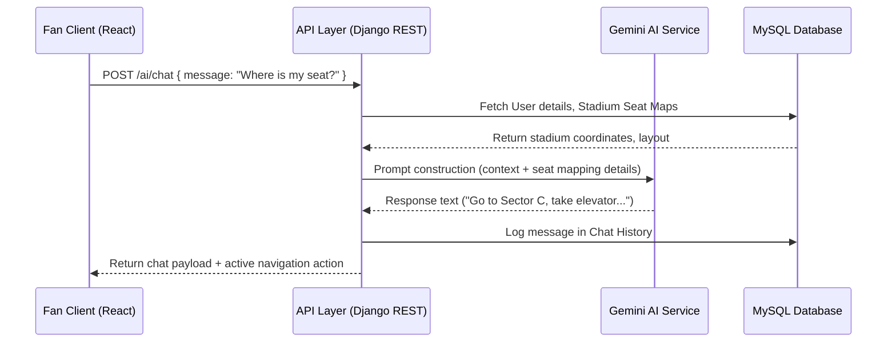
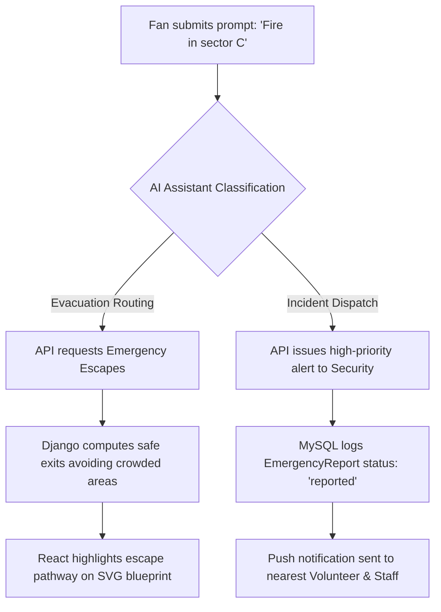

# System Architecture: FIFA AI Smart Stadium Copilot

This document outlines the end-to-end technical system architecture, repository structures, and AI workflows driving the **FIFA AI Smart Stadium Copilot**.

---

## 1. System Architecture Blueprint

```mermaid
graph TD
    %% Client Layer
    subgraph Client Layer (React SPA / Vite)
        A[Mobile Fan Interface]
        B[Staff Dashboard]
        C[Admin Command Center]
    end

    %% Edge & Auth Layer
    subgraph Gateway & Security
        D[Vite Dev Server / Netlify Edge]
        E[JWT Auth Middleware - DRF SimpleJWT]
        F[CORS Headers Security]
    end

    %% Application Layer
    subgraph Django Application Core (Python 3.11)
        G[DRF Router]
        H[AI Assistant Service]
        I[Crowd Prediction Engine]
        J[Navigation Engine]
        K[Operations Controller]
    end

    %% External AI Models
    subgraph Intelligent Services
        L[Google Gemini API]
        M[WebSpeech Speech-To-Text]
        N[WebSpeech Text-To-Speech]
    end

    %% Data Layer
    subgraph Database Layer
        O[(MySQL Relational Store)]
        P[(Local Storage Cache)]
    end

    %% Connections
    A & B & C --> D
    D --> E --> F --> G
    G --> H & I & J & K
    H <--> L
    A <--> M & N
    I & J & K <--> O
    A & B & C <--> P
```

---

## 2. React / Vite Frontend Folder Structure

```
frontend/
├── public/
│   └── favicon.ico
├── src/
│   ├── assets/
│   │   └── logo.png
│   ├── components/
│   │   ├── common/
│   │   │   ├── Navbar.jsx         # Sidebar navigation + sticky topbar
│   │   │   └── Footer.jsx         # General footer
│   │   ├── ai/
│   │   │   ├── ChatInterface.jsx  # Interactive AI terminal component
│   │   │   └── VoiceHandler.jsx   # Speech translation interface
│   │   ├── dashboard/
│   │   │   ├── StatCard.jsx       # Custom KPI widgets
│   │   │   └── MetricChart.jsx    # Sustainability & transport graphs
│   │   └── navigation/
│   │       └── StadiumMap.jsx     # Interactive SVG blueprint map
│   ├── context/
│   │   ├── AuthContext.jsx        # User login, JWT storage & RBAC rules
│   │   └── ThemeContext.jsx       # Theme state & dynamic accent selectors
│   ├── services/
│   │   ├── api.js                 # Axios wrapper config
│   │   └── aiService.js           # Google Gemini direct bridge
│   ├── pages/
│   │   ├── Home.jsx               # Hero landing
│   │   ├── About.jsx              # About FIFA Copilot platform
│   │   ├── Login.jsx              # User sign in
│   │   ├── Register.jsx           # User registration
│   │   ├── Dashboard.jsx          # Live matches & stats overview
│   │   ├── AIAssistant.jsx        # Smart Copilot terminal
│   │   ├── Navigation.jsx         # Interactive routing maps
│   │   ├── CrowdDashboard.jsx     # Heatmaps & queue status
│   │   ├── ParkingDashboard.jsx   # Real-time slots grids
│   │   ├── TransportDashboard.jsx # Public transit schedules
│   │   ├── SustainabilityDashboard.jsx # Eco statistics & tips
│   │   ├── VolunteerDashboard.jsx  # Task coordination UI
│   │   ├── EmergencyCenter.jsx    # Immediate incident response form
│   │   ├── AdminDashboard.jsx     # FIFA Command Center control
│   │   ├── Profile.jsx            # User profile preferences
│   │   ├── Settings.jsx           # Settings layout
│   │   └── Contact.jsx            # Contact details
│   ├── App.jsx                    # Routing mapping root
│   ├── index.css                  # Global Design System
│   └── main.jsx                   # Entry script
├── tailwind.config.js
├── vite.config.js
└── package.json
```

---

## 3. Django Backend Folder Structure

```
backend/
├── manage.py
├── requirements.txt
├── config/
│   ├── __init__.py
│   ├── settings.py                # Django Settings (MySQL & SimpleJWT)
│   ├── urls.py                    # Root URL Routing
│   └── wsgi.py
└── apps/
    ├── __init__.py
    ├── authentication/
    │   ├── models.py              # Extended user models & RBAC
    │   ├── serializers.py         # Login/Registration mapping serializers
    │   ├── views.py               # TokenObtainPair custom controller
    │   └── urls.py
    ├── ai_assistant/
    │   ├── views.py               # Gemini translation & chat models
    │   └── urls.py
    ├── crowd/
    │   ├── models.py              # Sensor occupancy storage
    │   ├── views.py               # Queue forecasting analytics
    │   └── urls.py
    ├── parking/
    │   ├── models.py              # Parking zone capacity tracking
    │   ├── views.py               # Slot recommendations endpoint
    │   └── urls.py
    ├── transport/
    │   ├── models.py              # Delay monitoring metrics
    │   ├── views.py               # Optimized route scheduling
    │   └── urls.py
    └── emergency/
        ├── models.py              # Security & Medical alert profiles
        ├── views.py               # Real-time incident logging
        └── urls.py
```

---

## 4. Key AI Dataflow Workflows (Mermaid Diagrams)

### A. Fan → AI Assistant Interactivity Flow


### B. AI Assistant → Navigation & Emergency Response Routing

